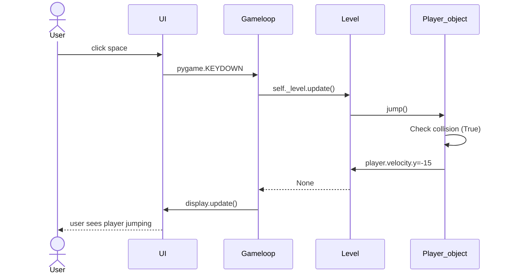
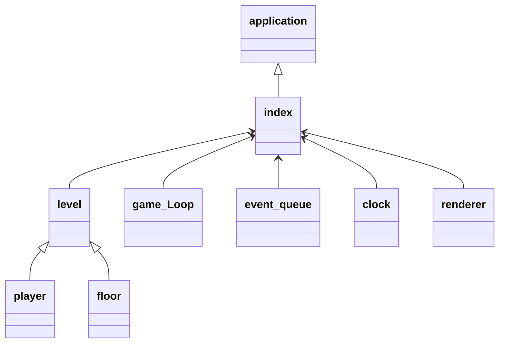

### Sekvenssikaavio pelaajan hyppäämisestä

```mermaid
sequenceDiagram
actor User
participant UI
participant Gameloop
participant Level
participant Player_object
User->>UI: click space
UI->>Gameloop: pygame.KEYDOWN
Gameloop->>Level: self._level.update()
Level->>Player_object: jump()
Player_object->>Player_object: Check collision (True)
Player_object->>Level: player.velocity.y=-15
Level-->>Gameloop: None
Gameloop->>UI: display.update()
UI-->>User: user sees player jumping
```

### Luokkakaavio

```mermaid
classDiagram
index <-- level
index <-- game_Loop
index <-- event_queue
index <-- clock
index <-- renderer
level <|-- player
level <|-- floor
application <|-- index
```
