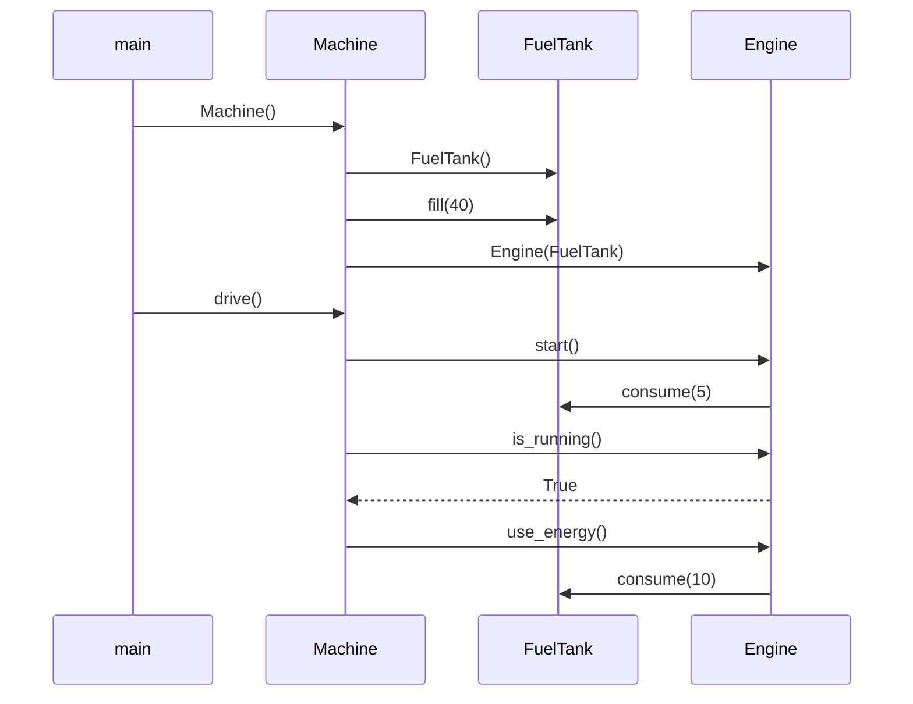

```mermaid
  sequenceDiagram
    participant main
    participant M as Machine
    participant F as FuelTank
    participant E as Engine
    main->>M: Machine()
    M->>F: FuelTank()
    M->>F: fill(40)
    M->>E: Engine(FuelTank)
    main->>M: drive()
    M->>E: start()
    E->>F: consume(5)
    M->>E: is_running()
    E-->>M: True
    M->>E: use_energy()
    E->>F: consume(10)
```
